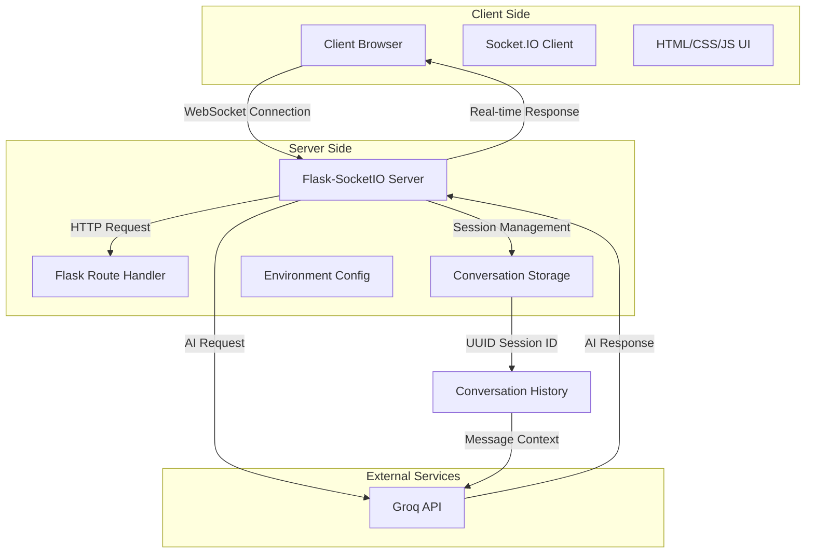
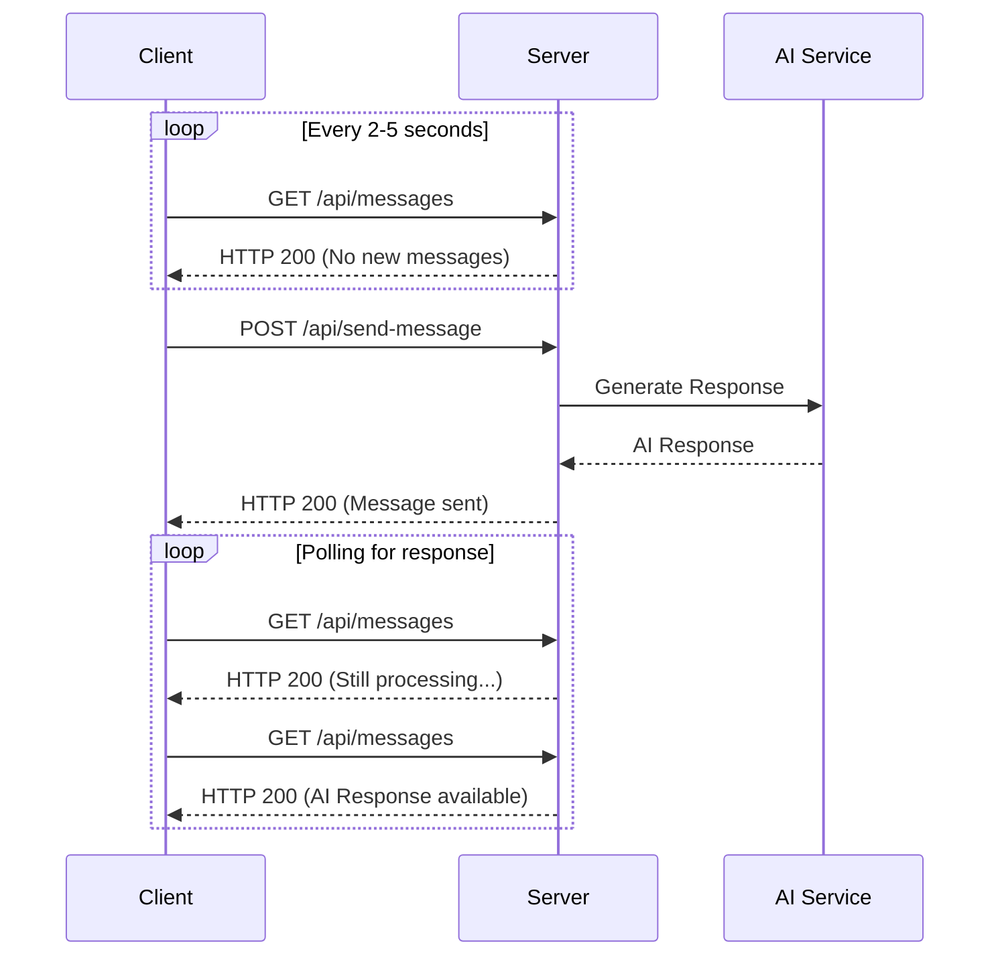
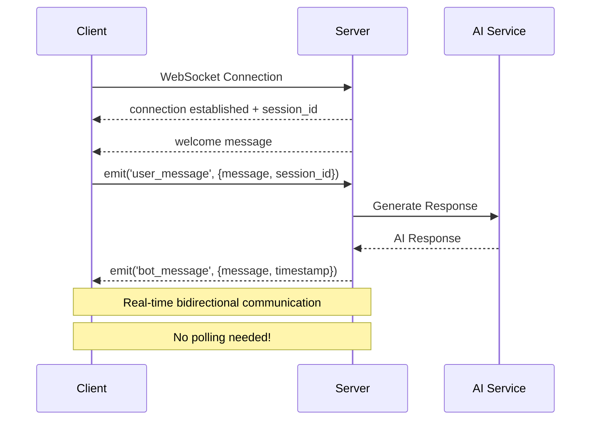
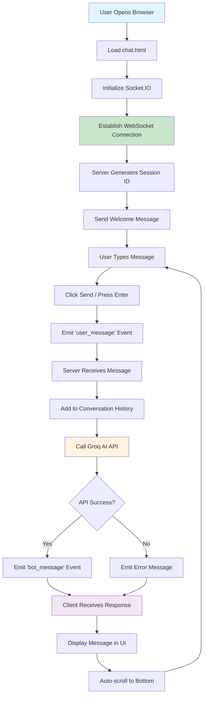

# 🤖 ChatbotWS - Real-time AI Chatbot with WebSocket

A modern, real-time chatbot application built with Flask, Socket.IO, and Groq AI, featuring a playful hand-drawn UI design and seamless WebSocket communication.

## 📋 Table of Contents

- [Overview](#overview)
- [Features](#features)
- [Architecture](#architecture)
- [WebSocket vs API Polling](#websocket-vs-api-polling)
- [Project Flow](#project-flow)
- [Installation](#installation)
- [Configuration](#configuration)
- [Usage](#usage)
- [API Documentation](#api-documentation)
- [Code Analysis](#code-analysis)
- [Deployment](#deployment)
- [Contributing](#contributing)

## 🎯 Overview

ChatbotWS is a real-time chatbot application that demonstrates the power of WebSocket technology for instant bidirectional communication. The application integrates with Groq's AI API to provide intelligent responses while maintaining conversation context through session management.

### Key Technologies
- **Backend**: Flask + Flask-SocketIO
- **Frontend**: HTML5 + CSS3 + JavaScript
- **AI Integration**: Groq API (Llama 3.3 70B)
- **Real-time Communication**: WebSockets
- **Session Management**: UUID-based sessions
- **Deployment**: Docker + GitHub Actions

## ✨ Features

- 🔄 **Real-time Communication**: Instant message delivery using WebSockets
- 🧠 **AI-Powered Responses**: Groq AI integration for intelligent conversations
- 💬 **Session Management**: Persistent conversation history per session
- 🎨 **Playful UI**: Hand-drawn style with smooth animations
- 📱 **Responsive Design**: Works seamlessly across devices
- 🔐 **Environment Security**: Secure API key management
- 🐳 **Containerized**: Docker support for easy deployment
- 🔄 **CI/CD Ready**: GitHub Actions workflow included

## 🏗️ Architecture



### Component Breakdown

| Component | Responsibility |
|-----------|---------------|
| **Flask App** | Main application server and routing |
| **Flask-SocketIO** | WebSocket connection management |
| **Session Manager** | UUID-based conversation tracking |
| **Groq Client** | AI API communication |
| **Frontend** | User interface and Socket.IO client |

## 🔄 WebSocket vs API Polling

### Traditional API Polling Approach



**Drawbacks of API Polling:**
- ⚡ **High Latency**: 2-5 second delays between polls
- 📈 **Resource Intensive**: Unnecessary HTTP requests
- 🔋 **Battery Drain**: Continuous polling on mobile devices
- 💸 **Bandwidth Waste**: Empty responses consume data
- 🚫 **Poor UX**: Users wait for updates

### WebSocket Implementation (Our Approach)



**Advantages of WebSockets:**
- ⚡ **Instant Communication**: Real-time message delivery
- 🔋 **Resource Efficient**: Single persistent connection
- 📱 **Mobile Friendly**: Reduces battery consumption
- 🎯 **Event-Driven**: Reactive programming model
- 💬 **Bidirectional**: Server can initiate communication

## 🔄 Project Flow



## 🚀 Installation

### Prerequisites
- Python 3.9+
- Groq API Key
- Git

### Local Development Setup

1. **Clone the repository**
   ```bash
   git clone https://github.com/yourusername/ChatbotWS.git
   cd ChatbotWS
   ```

2. **Create virtual environment**
   ```bash
   python -m venv envChatWS
   source envChatWS/bin/activate  # On Windows: envChatWS\Scripts\activate
   ```

3. **Install dependencies**
   ```bash
   pip install -r requirements.txt
   ```

4. **Environment configuration**
   ```bash
   cp .env.example .env
   # Edit .env with your Groq API key
   ```

5. **Run the application**
   ```bash
   python app.py
   ```

Visit `http://localhost:5000` to start chatting!

### Docker Setup

1. **Build the image**
   ```bash
   docker build -t chatbotws .
   ```

2. **Run container**
   ```bash
   docker run -p 5000:5000 --env-file .env chatbotws
   ```

## ⚙️ Configuration

Create a `.env` file in the project root:

```env
GROQ_API_KEY=your_groq_api_key_here
```

### Environment Variables

| Variable | Description | Required |
|----------|-------------|----------|
| `GROQ_API_KEY` | Groq AI API authentication key | Yes |

## 🎮 Usage

### Starting a Conversation
1. Open your browser to `http://localhost:5000`
2. Wait for the WebSocket connection to establish
3. Type your message and press Enter or click Send
4. Enjoy real-time AI responses!

### WebSocket Events

#### Client to Server Events
```javascript
// Send user message
socket.emit('user_message', {
    session_id: 'uuid-string',
    message: 'Hello, chatbot!'
});
```

#### Server to Client Events
```javascript
// Receive bot response
socket.on('bot_message', (data) => {
    console.log(data.message, data.timestamp);
});

// Handle connection events
socket.on('session_id', (data) => {
    sessionId = data.session_id;
});
```

## 📚 API Documentation

### WebSocket Events Reference

| Event | Direction | Data Structure | Description |
|-------|-----------|----------------|-------------|
| `connect` | Client → Server | - | Establish connection |
| `session_id` | Server → Client | `{session_id: string}` | Unique session identifier |
| `user_message` | Client → Server | `{session_id: string, message: string}` | User input |
| `bot_message` | Server → Client | `{message: string, timestamp: string}` | AI response |
| `error` | Server → Client | `{message: string}` | Error information |
| `disconnect` | Client → Server | - | Close connection |

### HTTP Endpoints

| Endpoint | Method | Description |
|----------|--------|-------------|
| `/` | GET | Serve chat interface |

## 🔍 Code Analysis

### Backend Architecture Analysis

#### Strengths ✅
1. **Clean Separation of Concerns**
   - Route handling separated from WebSocket events
   - AI integration abstracted into dedicated functions
   - Session management isolated

2. **Robust Error Handling**
   ```python
   try:
       response = client_groq.chat.completions.create(...)
   except Exception as e:
       emit('bot_message', {
           'message': f"Sorry, I encountered an error: {str(e)}",
           'timestamp': get_timestamp()
       })
   ```

3. **Secure Configuration**
   - Environment variables for sensitive data
   - API key validation at startup

4. **Session Management**
   - UUID-based unique sessions
   - Conversation history persistence
   - System prompt configuration

#### Areas for Improvement 🔧

1. **Memory Management**
   ```python
   # Current: In-memory storage
   conversation_histories = {}
   
   # Suggested: Add cleanup for old sessions
   def cleanup_old_sessions():
       # Remove sessions older than 24 hours
       pass
   ```

2. **Database Integration**
   ```python
   # Consider adding database persistence
   from flask_sqlalchemy import SQLAlchemy
   
   class Conversation(db.Model):
       id = db.Column(db.String(36), primary_key=True)
       messages = db.Column(db.JSON)
       created_at = db.Column(db.DateTime)
   ```

3. **Rate Limiting**
   ```python
   from flask_limiter import Limiter
   
   limiter = Limiter(
       app,
       key_func=get_remote_address,
       default_limits=["100 per hour"]
   )
   ```

### Frontend Architecture Analysis

#### Strengths ✅
1. **Modern Socket.IO Implementation**
   - Proper event handling
   - Connection status management
   - Auto-reconnection support

2. **Responsive Design**
   - Mobile-friendly interface
   - Smooth animations
   - Accessible color contrast

3. **User Experience**
   - Real-time typing feedback
   - Message timestamps
   - Auto-scroll functionality

#### Performance Optimizations 🚀

1. **Message Rendering**
   ```javascript
   // Consider virtual scrolling for large conversations
   function addMessage(sender, message, timestamp) {
       // Current implementation appends to DOM
       // Optimize for 1000+ messages
   }
   ```

2. **Connection Management**
   ```javascript
   // Add connection retry logic
   socket.on('disconnect', () => {
       setTimeout(() => {
           socket.connect();
       }, 5000);
   });
   ```

## 🐳 Deployment

### Production Deployment with Docker

1. **Build production image**
   ```bash
   docker build -t chatbotws:prod .
   ```

2. **Deploy with docker-compose**
   ```yaml
   version: '3.8'
   services:
     chatbot:
       image: chatbotws:prod
       ports:
         - "80:5000"
       environment:
         - GROQ_API_KEY=${GROQ_API_KEY}
       restart: unless-stopped
   ```

### CI/CD Pipeline

The GitHub Actions workflow automatically:
- ✅ Runs tests on multiple Python versions
- 🔍 Performs code linting
- 🐳 Builds and pushes Docker images
- 🚀 Triggers deployment on successful builds

## 🤝 Contributing

1. Fork the repository
2. Create a feature branch (`git checkout -b feature/amazing-feature`)
3. Commit changes (`git commit -m 'Add amazing feature'`)
4. Push to branch (`git push origin feature/amazing-feature`)
5. Open a Pull Request

### Development Guidelines

- Follow PEP 8 for Python code
- Add tests for new features
- Update documentation
- Ensure Docker builds successfully

## 📄 License

This project is licensed under the MIT License - see the [LICENSE](LICENSE) file for details.

## 🙏 Acknowledgments

- [Flask-SocketIO](https://flask-socketio.readthedocs.io/) for WebSocket support
- [Groq](https://groq.com/) for AI capabilities
- [Socket.IO](https://socket.io/) for real-time communication

---

**Built with ❤️ for learning WebSocket technology and real-time applications**